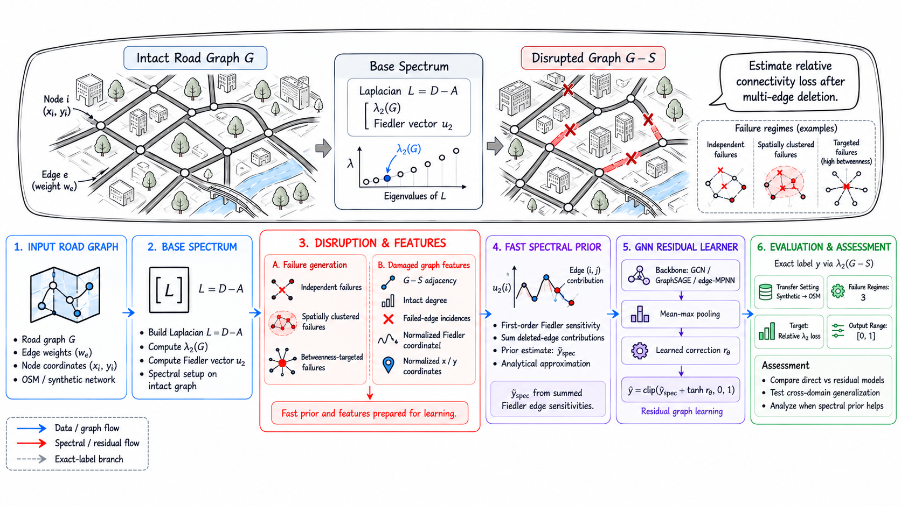

# ResiliRoad

[](https://doi.org/10.5281/zenodo.22307723)

Reproducible code and artefacts for **When Does a Spectral Prior Help Graph
Learning? Connectivity-Loss Estimation under Road-Network Disruptions**.

ResiliRoad estimates the relative loss of algebraic connectivity after multiple
road-network edges fail. It combines an interpretable first-order Fiedler
sensitivity with a graph neural network that learns only the residual
correction.



## Main findings

The study uses five random seeds, graph-disjoint synthetic splits, independent,
spatially clustered, and targeted-betweenness disruptions, and zero-shot
transfer to 13 OpenStreetMap areas across six Asian countries. OSM uncertainty
uses a hierarchical bootstrap with area as the outer cluster and seed nested
within area.

| OSM failure process | Direct GCN MAE | Residual GCN MAE | Paired improvement [95% CI] |
|---|---:|---:|---:|
| Independent | 0.102 | 0.085 | 0.0167 [-0.0019, 0.0338] |
| Spatial cluster | 0.096 | 0.057 | 0.0391 [0.0151, 0.0662] |
| Targeted betweenness | 0.145 | 0.135 | 0.0097 [-0.0095, 0.0268] |

Synthetic intervals resample seeds; OSM intervals resample areas and then
seeds, never treating correlated scenarios as independent. Fiedler-feature and coordinate ablations
are inconclusive with five seeds; the stable improvement comes from using the
analytical estimate as an explicit residual prior.

This is a structural-disruption study. It is not a flood prediction, traffic
assignment, or city-wide resilience model.

The journal extension also finds an important boundary condition. When models
are trained on three OSM areas, validated on a fourth, and tested on a fifth,
the direct GCN is more stable than the residual GCN (MAE 0.135 vs 0.161 for
independent and 0.109 vs 0.144 for spatial failures). The repository therefore
does not claim that the spectral residual is universally superior. The paired
area-outer hierarchical intervals include zero, so this reversal is a caution about stability
and domain shift rather than a confirmed direct-GCN advantage.

The matched per-regime leave-one-country-out test holds out each of six
countries in turn. Residual GCN has lower point-estimate MAE for independent
failures (0.145 vs 0.182) and targeted failures (0.196 vs 0.258), but higher
MAE for spatial clusters (0.149 vs 0.061). Only targeted failure has a
country-clustered interval excluding zero. A joint-training sensitivity run has
the same sign pattern, ruling out multi-regime pooling as its explanation.

The conclusion is not tied to vanilla GCN: direct and residual GraphSAGE and
edge-aware MPNN models were run with the same data and optimization protocol. Residual GraphSAGE improves
paired MAE on both synthetic modes and OSM-independent transfer; the OSM-spatial
interval includes zero. A sparse CPU benchmark reaches 20,000 nodes, where
exact recomputation takes 1.302 s per scenario versus 23.17 ms for the
amortized spectral-prior plus sparse-GNN path when screening 1,000 scenarios.
The expanded study also includes a truncated second-order perturbation baseline,
eigengap-stratified errors, calibration of learned versus needed corrections,
and descriptive residual-gain diagnostics against graph size and density.

## Methods compared

- exact post-disruption eigendecomposition as ground truth;
- first- and truncated second-order Fiedler perturbation approximations;
- direct and residual GCN, GraphSAGE, and edge-aware MPNN models;
- GCN ablations without the Fiedler node feature or coordinates;
- Deep Sets and graph-summary MLP baselines.

The OSM evaluation covers 13 areas in Vietnam, Singapore, Malaysia, Thailand,
Taiwan, and Japan. Cached graphs range from 48 to 1,259 nodes.

## Reproduce the paper

Python 3.11+ is recommended. A GPU is not required; the reported experiment was
run entirely on CPU with one PyTorch compute thread.

```powershell
pip install -r requirements.txt
.\reproduce_all.ps1
```

Individual stages can also be run separately:

```powershell
python download_osm.py
python run_paper_benchmark.py --seed 11 --output outputs/paper/seed_11
python analyze_paper_results.py --input outputs/paper --output outputs/paper_summary
python run_scaling_benchmark.py
python run_large_scaling_benchmark.py
python run_geographic_transfer.py --seed 11 --scenarios-per-site-mode 40 --epochs 25 --output outputs/geographic_transfer/seed_11
python analyze_journal_results.py
python analyze_jcn2_results.py
python run_country_transfer.py --seed 11 --scenarios-per-area-mode 8 --epochs 12 --training-protocol per_mode --output outputs/country_transfer_per_mode/seed_11
python analyze_country_transfer.py --input outputs/country_transfer_per_mode --output outputs/country_transfer_per_mode_summary
python collect_environment.py
python create_method_overview.py
python create_osm_triptych.py
```

Repeat the benchmark for seeds `11`, `22`, `33`, `44`, and `55`. The wrapper
script performs this loop and compiles the paper.

## Repository structure

- [`journal/`](journal/) - Journal of Complex Networks manuscript, cover letter,
  and submission checklist.
- [`report/`](report/) - conference-report LaTeX source and PDF.
- [`poster/`](poster/) - final VMS60 poster source and PDF.
- [`resilience/`](resilience/) - scenario generation, models, and training.
- [`data/osm/`](data/osm/) - cached OSM graphs and download manifest.
- [`outputs/paper_summary/`](outputs/paper_summary/) - bootstrap metrics, paired
  differences, error analysis, runtime, and environment metadata.
- [`outputs/jcn2_summary/`](outputs/jcn2_summary/) - area-clustered expanded
  results, eigengap analysis, correction diagnostics, and analytical controls.
- [`outputs/country_transfer_per_mode_summary/`](outputs/country_transfer_per_mode_summary/) -
  matched per-regime leave-one-country-out metrics and country diagnostics.
- [`docs/EXPERIMENT_MATRIX.md`](docs/EXPERIMENT_MATRIX.md) - preregistered
  experiment and claim matrix.

## Paper and poster

- [Journal of Complex Networks manuscript](journal/output/pdf/ResiliRoad_JCN_Manuscript.pdf)
- [JCN cover letter](journal/output/pdf/ResiliRoad_JCN_Cover_Letter.pdf)
- [Final paper PDF](report/output/pdf/ResiliRoad_Final_Paper.pdf)
- [Final VMS60 poster PDF](poster/output/pdf/ResiliRoad_VMS60_Poster.pdf)
- [Method overview (SVG)](figures/method_overview.svg)

## Citation

The exact `v1.0.0` reproducibility release is permanently archived on Zenodo:
[doi:10.5281/zenodo.22307723](https://doi.org/10.5281/zenodo.22307723).

```bibtex
@software{le_resiliroad_2026,
  author    = {Le, Van-Truong},
  title     = {ResiliRoad: residual spectral graph learning for road-network disruption analysis},
  version   = {1.0.0},
  year      = {2026},
  publisher = {Zenodo},
  doi       = {10.5281/zenodo.22307723},
  url       = {https://doi.org/10.5281/zenodo.22307723}
}
```

## Author

**Van-Truong Le**  
Faculty of Information Technology, University of Science, Viet Nam National
University Ho Chi Minh City, Viet Nam  
23120181@student.hcmus.edu.vn | lvtruong@selab.hcmus.edu.vn

ORCID: [0009-0008-7015-7392](https://orcid.org/0009-0008-7015-7392)

## Data licence

OpenStreetMap data are copyright OpenStreetMap contributors and available under
the Open Database License. Cached networks are used only for structural
disruption experiments.
